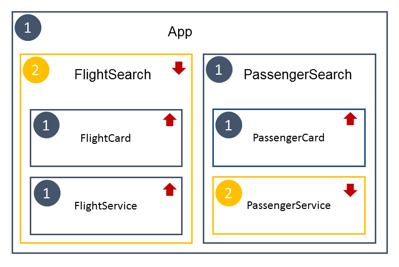

# Sample for ngUpgrade with AOT

## Overview



## Structure

- ``app/app.module.ts``: Angular 1 module
- ``app/app2.module.ts``: Angular 2 module
- ``app/app.ts``: Bootstraps the hybrid application

## Problems

The FlightSearchComponent is not able to display the upgraded FlightCardComponent (after searching for flights from ``Graz`` to ``Hamburg``). 

The FlightCardComponent is defined within the file ``app.module.ts`` which creates an angular1 module. The file ``app2.module.ts`` defines an ng2-based facade for it.
 
The same holds true for an component ng1 that works like the ng1-component in the test cases.

## The good message

Every other scenario displayed above already works in this sample.

## Build and Start

- Build: ``npm run build`
    - Runs ngc and webpack
- Start: ``npm start``
    - Does not created a build, so run ``npm run build`` before
    - Starts live-server
    
## Other questions

1. Why don't we have a convenience function for upgrading, like we had when using UpgradeAdapter? For instance, currently we have to do this, to perform an upgrade:

```
@Directive({selector: 'ng1'})
export class Ng1 extends UpgradeComponent {

    constructor(elementRef: ElementRef, injector: Injector) {
        super('ng1', elementRef, injector);
    }
}
```

Is this because a convenience function would be too dynamic for the compiler?

2. Why do all the samples and test cases use ``platformBrowserDynamic``, although we are using AOT? 

```
bootstrap(
    platformBrowserDynamic(),
    AppModuleNgFactory,
    document.body,
    'flight-app')
```

    